# Prédiction de la Satisfaction des Passagers d'une Compagnie Aérienne

> Mission de consultant Data/BI pour une compagnie aérienne — analyse exploratoire, facteurs explicatifs & classification binaire sur 129 880 passagers

[](https://www.python.org/)
[](https://scikit-learn.org/)
[](https://scikit-learn.org/stable/modules/generated/sklearn.linear_model.LogisticRegression.html)
[](https://scikit-learn.org/stable/modules/generated/sklearn.neighbors.KNeighborsClassifier.html)
[](https://www.kaggle.com/datasets/teejmahal20/airline-passenger-satisfaction)
[](LICENSE)

---

## Objectif

En tant que consultant Data/BI pour une compagnie aérienne, la mission est d'**identifier les facteurs explicatifs clés de la satisfaction client** et de développer une **solution algorithmique de classification** permettant de prédire le niveau de satisfaction des passagers.

**L'objectif principal** était de développer un pipeline complet capable de :

- analyser **129 880 passagers** (103 904 en entraînement, 25 976 en test, split déjà fourni) ;
- identifier les facteurs les plus liés à la satisfaction, au-delà des intuitions de départ ;
- interroger explicitement la différence entre **corrélation et causalité** ;
- prédire le niveau de satisfaction avec deux modèles de classification, comparés rigoureusement ;
- traduire les résultats en **recommandations opérationnelles actionnables** pour la compagnie.

**Objectifs métier :**
- Comprendre ce qui fait réellement la différence entre un passager satisfait et un passager mécontent ;
- Identifier les leviers de service sur lesquels investir en priorité ;
- Construire un score de risque d'insatisfaction exploitable en production pour cibler une action proactive.

---

## Problématique métier

Un passager insatisfait non détecté est un passager perdu — churn, avis négatif, bouche-à-oreille défavorable — sans qu'aucune action corrective n'ait pu être déclenchée à temps.

L'enjeu est donc de transformer les données de vol et de service en un système d'aide à la décision capable de :

- repérer, avant qu'il ne se détourne, un passager à risque d'insatisfaction ;
- distinguer les leviers réellement actionnables (qualité de service) des simples marqueurs de profil (fidélité, classe) ;
- arbitrer explicitement le coût d'un passager insatisfait non détecté contre le coût d'une fausse alerte.

---

## Dataset

| Caractéristique | Détail |
|---|---|
| Source | [Airline Passenger Satisfaction — Kaggle](https://www.kaggle.com/datasets/teejmahal20/airline-passenger-satisfaction) |
| Volume | 129 880 passagers (103 904 train / 25 976 test, split fourni) |
| Variables | 22 variables explicatives (profil, voyage, 14 notes de service, retards) |
| Variable cible | `satisfaction` : binaire (`satisfied` / `neutral or dissatisfied`) |
| Répartition cible | 56.7 % neutral or dissatisfied / 43.3 % satisfied — déséquilibre léger (ratio 1.3) |

#### Variables exploitées

- **Profil passager** : genre, âge, type de client (fidèle / non fidèle)
- **Contexte de voyage** : type de voyage (affaires / personnel), classe, distance de vol
- **Expérience de service** : 14 notes 0–5 (wifi, embarquement en ligne, confort, divertissement, propreté, restauration, bagages, etc.)
- **Ponctualité** : retard au départ et à l'arrivée (minutes)

---

## Pipeline Data Science

**Chargement → Nettoyage → EDA → Feature Engineering → Modélisation → Évaluation → Interprétation → Choix méthodologiques**

### 1. Nettoyage des données
- gestion de la seule variable à valeurs manquantes (`Arrival Delay in Minutes`, 0.3 %), imputée par un proxy corrélé plutôt qu'une médiane générique ;
- vérification de la fréquence des notes de service à 0 pour trancher s'il faut les traiter comme manquantes ;
- suppression des colonnes techniques sans valeur prédictive.

### 2. Analyse Exploratoire des Données (EDA)
Trois constats structurants, validés par tests statistiques (Chi², Mann-Whitney, corrélations) :
- le profil **« voyage d'affaires + client fidèle »** concentre l'essentiel de la satisfaction (écart de 48 points avec le voyage personnel) ;
- la **qualité de service perçue** pèse bien plus lourd que la **ponctualité** — corrélation quasi nulle entre retard et satisfaction (-0.05), contre 0.3 à 0.5 pour les notes de service ;
- l'effet de l'**âge est non-linéaire** : la satisfaction culmine à 45-60 ans (57.4 %) puis rechute chez les seniors (20.8 %).

### 3. Feature engineering
Trois variables construites, chacune ancrée dans un constat de l'EDA et validée par sa corrélation avec la cible avant d'être retenue — dont une variable d'interaction (`loyal_business`) qui devient à elle seule la variable la plus corrélée du dataset (0.56).

### 4. Modélisation et comparaison de 2 modèles
Démarche identique pour les deux modèles : **baseline → tuning (GridSearchCV, 5 folds) → modèle final**, avec un test empirique de la stratégie de gestion du déséquilibre des classes plutôt qu'une règle appliquée par défaut.

### 5. Évaluation, interprétation & choix méthodologiques
Optimisation du seuil de décision, lecture des coefficients de la régression logistique, **test d'ablation** vérifiant empiriquement l'intérêt de conserver les variables faiblement corrélées, et section dédiée récapitulant et justifiant chaque décision structurante du projet.

---

## Modèles comparés

| Modèle | Notes |
|---|---|
| Régression Logistique | Modèle de référence interprétable — coefficients directement lisibles pour justifier les choix analytiques |
| **KNN** | **Meilleures performances sur toutes les métriques — modèle retenu pour la prédiction** |

### Résultats sur le jeu de test externe (seuil 0.5)

| Modèle | Accuracy | Recall (classe insatisfait) | Précision | F1 macro | ROC AUC |
|---|---|---|---|---|---|
| Régression Logistique | 0.871 | 0.901 | 0.874 | 0.869 | 0.926 |
| **KNN (k=11, distance)** | **0.931** | **0.967** | **0.914** | **0.929** | **0.980** |

---

## Visuels clés du projet

### 1. Distribution de la variable cible
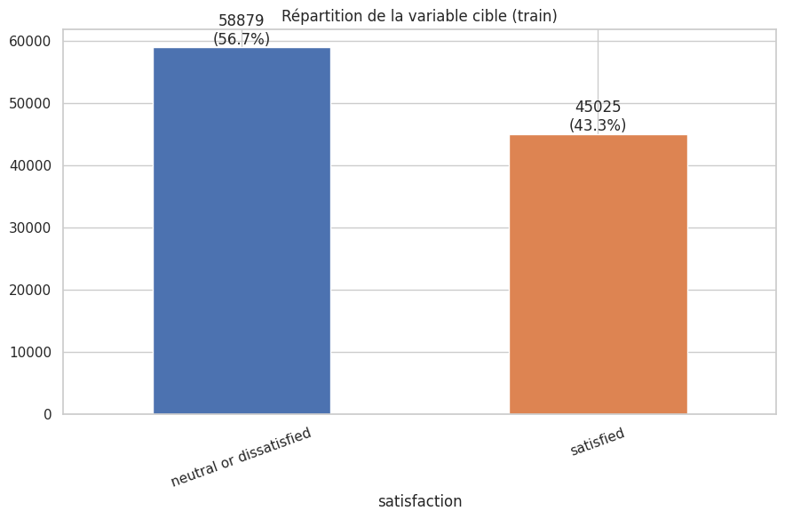
- 56.7 % neutral or dissatisfied vs 43.3 % satisfied — déséquilibre léger, cohérent entre train et test.

### 2. Profil voyageur : type de voyage, classe, fidélité
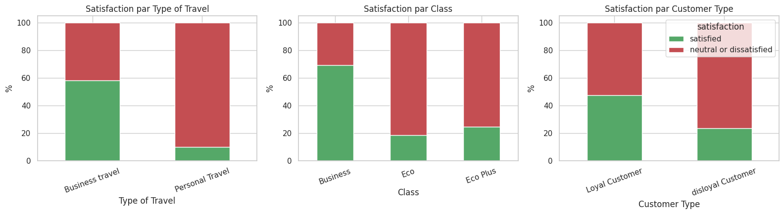
- le constat le plus discriminant du dataset : jusqu'à 48 points d'écart de satisfaction selon le profil de voyage.

### 3. Test du Chi² entre variables catégorielles et satisfaction
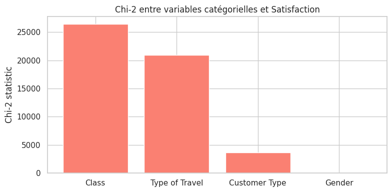
- démontre la distinction entre significativité statistique et pertinence pratique.

### 4. Écart de perception par service
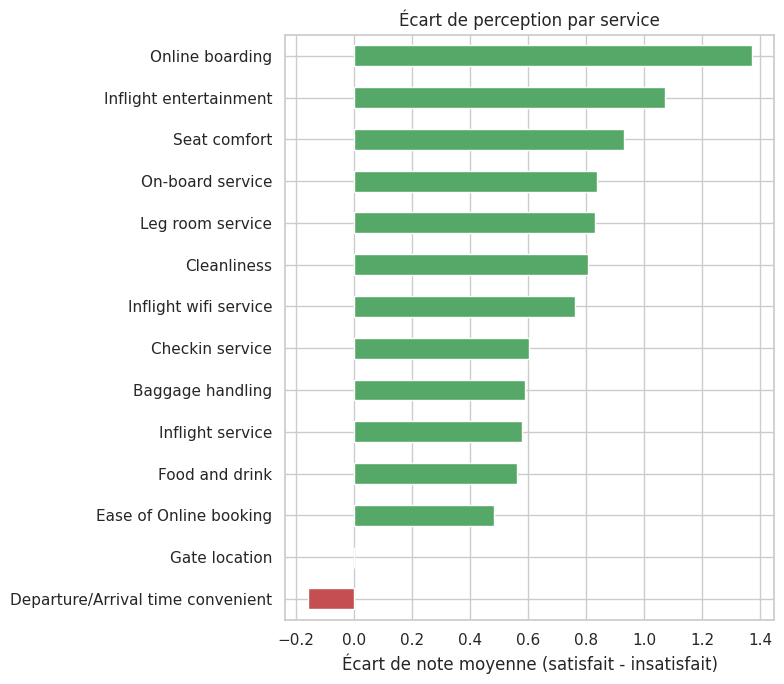
- Online boarding (+1.37 pt) et Inflight entertainment (+1.07 pt) ressortent comme les leviers les plus discriminants.

### 5. Corrélation des variables numériques avec la satisfaction
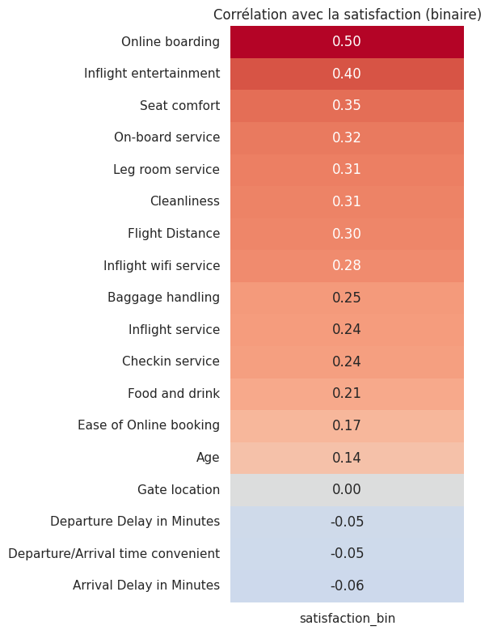
- révèle le résultat contre-intuitif central du projet : la ponctualité pèse presque rien face à la qualité de service perçue.

### 6. Taux de satisfaction par tranche d'âge
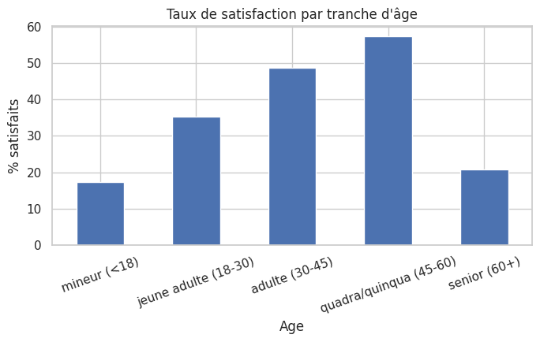
- courbe en cloche justifiant le choix d'un second modèle non-linéaire.

### 7. Multicolinéarité entre les 14 notes de service
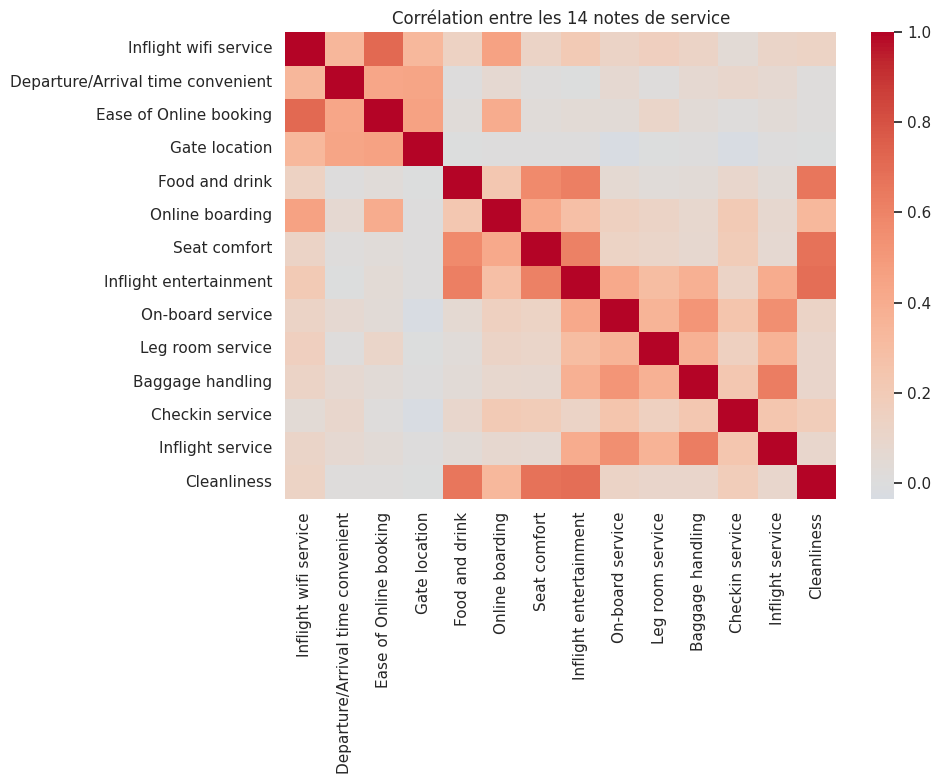
- met en évidence le « halo effect » et la prudence nécessaire dans la lecture des coefficients bruts.

### 8. Recherche du nombre de voisins optimal (KNN)
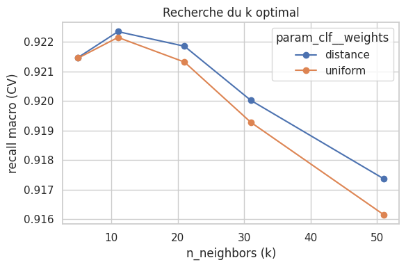
- comparaison des stratégies de pondération `uniform` vs `distance` sur une grille de valeurs de k.

### 9. Matrices de confusion — jeu de test externe
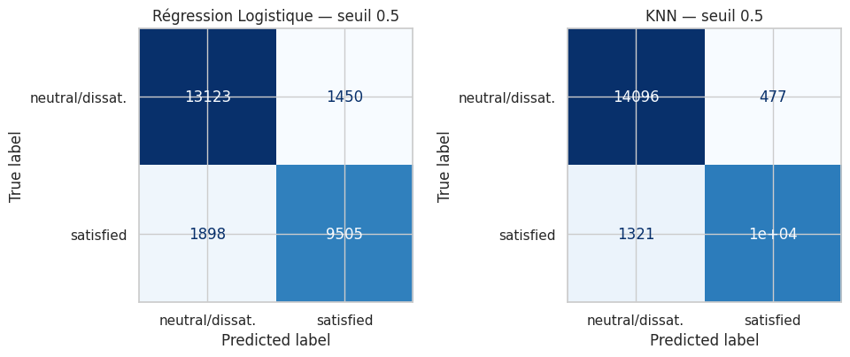

### 10. Courbes ROC
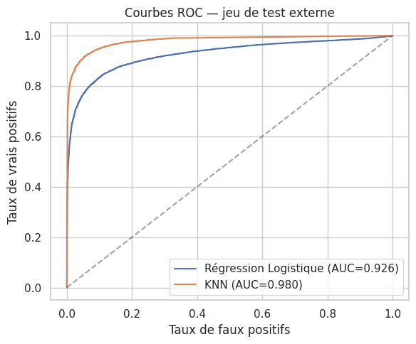
- démontre la maîtrise de l'évaluation probabiliste des deux modèles.

### 11. Optimisation du seuil de décision
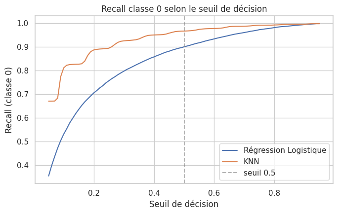
- arbitrage précision/recall piloté par le seuil plutôt que par un rééquilibrage des classes.

### 12. Coefficients de la régression logistique
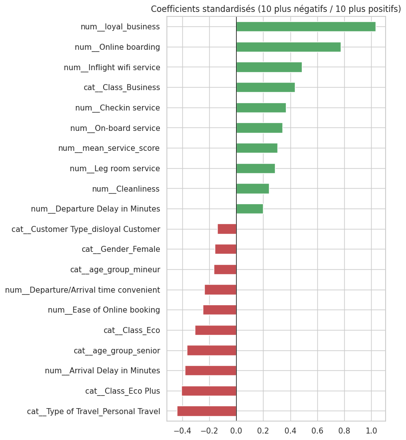
- les 10 facteurs les plus positifs et les plus négatifs, avec un focus sur deux résultats contre-intuitifs en multivarié.

---

## Rigueur méthodologique

Ce projet accorde une attention particulière à la **justification de chaque choix analytique**, plutôt qu'à l'application de règles par défaut :

- **Split train/test** : le vrai jeu de test externe fourni par la compagnie est utilisé une seule fois, à la toute fin, jamais pour l'entraînement ni le tuning — garantie contre le sur-ajustement.
- **Gestion du déséquilibre des classes** : `class_weight='balanced'` a été testé empiriquement et **rejeté** car il dégradait la métrique métier prioritaire (la classe prioritaire étant déjà majoritaire) — arbitrage piloté par le seuil de décision à la place.
- **Test d'ablation** : suppression testée empiriquement de 3 variables faiblement corrélées, uniquement sur le modèle le plus exposé à ce risque (KNN) — décision de les conserver justifiée par un résultat chiffré, pas par principe.
- **Choix de conserver le détail plutôt que le résumer** : les 14 notes de service individuelles sont gardées en plus de leur moyenne agrégée, car c'est ce niveau de détail qui permet d'identifier *quel* service améliorer en priorité — un argument opérationnel, pas seulement statistique.
- **Section dédiée « Choix méthodologiques »** (11 sous-sections) récapitulant et justifiant chaque décision structurante du projet.

---

## Résultats obtenus

Le modèle final (KNN) permet :
- une détection très fiable des passagers insatisfaits (recall de 96.7 %) ;
- une bonne capacité de discrimination globale (ROC AUC de 0.980) ;
- un modèle d'interprétation complémentaire (régression logistique) pour traduire les résultats en recommandations lisibles par des équipes métier.

## Recommandations métier

- Prioriser les investissements sur l'expérience digitale d'embarquement et le divertissement à bord, plutôt que sur la seule réduction des retards.
- Utiliser le score de risque prédictif pour cibler en priorité les voyageurs personnels en classe Eco, jeunes ou seniors — les profils les plus à risque identifiés.
- Ajuster le seuil de décision du modèle en production selon la capacité opérationnelle de l'équipe relation-client à traiter les alertes générées.

---

## Livrables

Ce projet va au-delà du notebook : il inclut l'ensemble des livrables attendus d'une mission de consulting Data réelle.

| Livrable | Description |
|---|---|
| [`notebook.ipynb`](notebook.ipynb) | Notebook complet en français — EDA, feature engineering, modélisation, évaluation, interprétation, choix méthodologiques |
| [`notebook_en.ipynb`](notebook_en.ipynb) | Version intégralement traduite en anglais (markdown + code + visuels) |
| [`docs/rapport_satisfaction_client.docx`](docs/rapport_satisfaction_client.docx) | Rapport écrit de synthèse (10 pages), justifiant les choix analytiques |
| [`docs/presentation_satisfaction_client.pptx`](docs/presentation_satisfaction_client.pptx) | Support de présentation orale (14 slides) |

---

## Stack technique

`Python` · `Pandas` · `NumPy` · `Scikit-learn` · `Logistic Regression` · `KNN` · `SciPy` (tests statistiques) · `Matplotlib` · `Seaborn` · `Jupyter Notebook`

---

## Structure du repo

```bash
airline-satisfaction-ml
├── notebook.ipynb              ← Pipeline complet (français)
├── notebook_en.ipynb           ← Pipeline complet (anglais)
├── README.md
├── LICENSE
├── requirements.txt
├── data/
│   └── readme.md               ← Source et description du dataset
├── docs/
│   ├── rapport_satisfaction_client.docx
│   └── presentation_satisfaction_client.pptx
└── img/
    └── *.png                   ← Visuels clés du projet (EDA + ML)
```

---

## Compétences démontrées

- **Data Analysis** : EDA structurée en constats, tests statistiques (Chi², Mann-Whitney), lecture critique corrélation vs causalité.
- **Machine Learning** : classification supervisée, tuning par validation croisée, gestion du déséquilibre de classes, optimisation de seuil, test d'ablation.
- **Feature Engineering** : construction de variables justifiées par l'analyse, validation systématique par corrélation avant intégration.
- **Interprétabilité** : lecture de coefficients standardisés, distinction explicite entre performance pure et modèle interprétable pour le métier.
- **Communication Data** : rapport écrit, présentation orale, notebook bilingue, storytelling analytique orienté décision business.

## Ce que ce projet démontre

Au-delà du Machine Learning, ce projet démontre ma capacité à :
- structurer un projet Data Science complet, de la donnée brute à la recommandation métier ;
- justifier systématiquement mes choix méthodologiques plutôt que d'appliquer des règles par défaut ;
- tester empiriquement mes hypothèses plutôt que de les affirmer par principe ;
- produire des livrables complets et professionnels (notebook, rapport, présentation, version bilingue) ;
- expliquer clairement des résultats techniques à un public métier non-data.

---

## Auteur

**Cedric Enzo KOUOKAM KAMHOUA** — Data Analyst / Data Scientist / BI — Epitech Toulouse

Machine Learning • NLP • Data Visualization • Business Analytics

[LinkedIn](https://www.linkedin.com/in/enzo-kamhoua/) · [GitHub](https://github.com/kenzo-kouokam) · [Portfolio](https://kenzo-kouokam.github.io/cedric.kouokam/) · [CV](https://github.com/kenzo-kouokam/cedric.kouokam/blob/main/img/Enzo_KOUOKAM.pdf)
